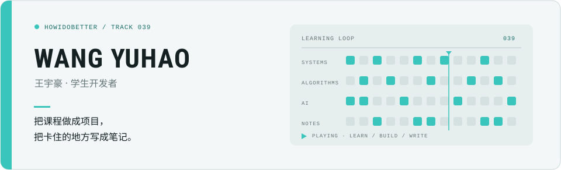

  <picture>
    <source media="(max-width: 600px)" srcset="./assets/profile-hero-mobile.svg">
    
  </picture>

<b>王宇豪</b> · 学生开发者

补系统基础，做 AI 课程实验，写一份自己会回看的笔记。

<a href="https://howidobetter.github.io">浏览博客笔记 →</a>

 

## 四个常驻标签页

- [`notes/`](https://howidobetter.github.io) — 学习笔记与踩坑记录，只留下以后还用得上的东西
- [`systems/`](https://github.com/howIdobetter/MIT6.828_self_learning_fall20) — MIT 6.828 自学实验与项目
- [`algorithms/`](https://github.com/howIdobetter/leetcode) — LeetCode C++ 题解与刷题记录
- [`ai-methods/`](https://github.com/howIdobetter/AI-methods) — 人工智能方法课程实验报告

---

39 · 慢慢学，认真写。

